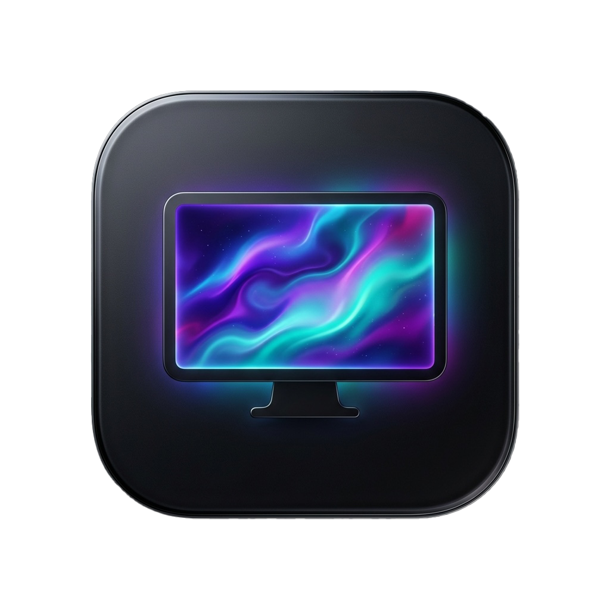
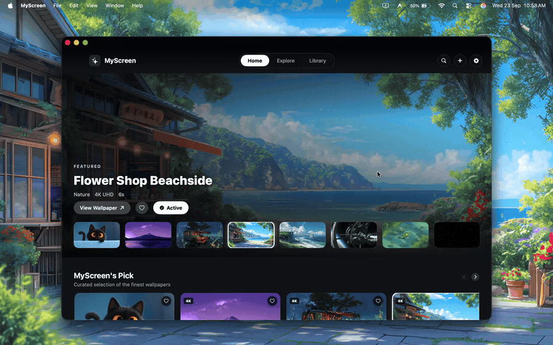

# MyScreen 🖥️✨

<div align="center">
  
  <h2>MyScreen</h2>
  <h3>Next-Generation 4K Live Video Wallpaper Engine for macOS</h3>
  <p>Bring your desktop to life with buttery-smooth 4K video wallpapers, seamless multi-monitor playback, and lock screen integration.</p>

  [](https://apple.com)
  [](https://swift.org)
  []()
  [](LICENSE)
  [](https://github.com/Sai8555/MyScreen/releases)

  <br/><br/>
  <!-- Live Video Playback Demo (Auto-plays on GitHub) -->
  
</div>

---

## 🌟 Overview

**MyScreen** is a high-performance, lightweight, open-source live video wallpaper application built natively for macOS using **SwiftUI**, **AppKit**, and **AVFoundation**. 

It plays high-definition 4K and 1080p looped videos directly on your desktop layer without getting in the way of your workflow—your desktop icons, right-click menus, selections, and windows work exactly as normal.

---

## ✨ Key Features

### 🎬 Ultra HD Live Wallpapers
* **Massive Curated Catalog**: Hundreds of curated, looping wallpapers across genres including **Nature & Landscapes**, **Sci-Fi & Cyberpunk**, **Anime Worlds**, **Video Games**, **City & Urban**, **Supercars**, and **Lo-Fi / Aesthetic**.
* **Automatic 4K Master Video Upgrade**: Starts playing instantly with a zero-delay streaming preview, then silently caches the full pristine 4K master video to your local SSD in the background.
* **Offline Playback**: Once cached, wallpapers play 100% locally from your device with zero internet consumption.

### 🖥️ Independent Multi-Display & iPad Sidecar Support
* **Per-Display Playback Sessions**: Assign **Wallpaper A** to your primary Mac display and **Wallpaper B** to an external monitor or an **iPad connected via Sidecar**—both run simultaneously without pausing each other!
* **Smart Audio Routing**: Primary display plays wallpaper audio (respecting volume and mute settings); secondary displays are muted automatically to prevent audio clash and echo.
* **Hot-Plug Reconnection**: Automatically remembers which wallpaper was assigned to each screen when monitors or iPads are disconnected and reconnected.

### 🖱️ 100% Native Mouse & Icon Pass-Through
* Video is rendered at the system desktop window level (`CGWindowLevelForKey(.desktopWindow)`).
* Full click and drag pass-through (`ignoresMouseEvents = true`): Your desktop icons, rubber-band selections, and Finder context menus work seamlessly.

### 🔒 macOS Lock Screen Synchronization
* Dynamically extracts high-resolution 4K frames and updates macOS `NSWorkspace.shared.setDesktopImageURL`.
* When your Mac goes to the Lock Screen or you open macOS System Settings > Displays, your chosen wallpaper is displayed accurately.

### 📁 Custom Video Import ("My Videos")
* Drag and drop any personal `.mp4` or `.mov` file into the app.
* Automatically extracts frame dimensions, calculates duration, generates preview thumbnails, and adds it to your personal live wallpaper collection.

### ⚡ Smart Power & Sleep Management
* **Auto-Pause on Display Sleep**: Video decoding halts when your displays sleep to conserve hardware resources.
* **Auto-Resume on Wake**: Seamlessly resumes playback when the screen turns back on.
* **Low Battery Saver**: Automatically halts video playback when your MacBook enters Low Power Mode.

### 🎛️ Menu Bar Companion
* Sits cleanly in your macOS Menu Bar for quick 1-click **Play / Pause**, **Mute / Unmute**, **Skip Forward / Backward**, and cache diagnostics.

---

## ⚡ Hardware & Battery Guidance

> [!NOTE]
> Rendering continuous 4K video at 60 FPS is a graphics-intensive task. Here is what you should expect depending on your hardware:

* **Mac mini, Mac Studio, & Mac Pro (Recommended!)**:
  * **Phenomenal Experience**: Desktop Macs connected to AC power deliver continuous, silky-smooth 4K 60 FPS live wallpaper animations 24/7 with zero heat or battery concerns. The Apple Silicon media engines handle decoding with near-zero CPU footprint.
* **MacBook Pro & MacBook Air (Plugged into Power)**:
  * Delivers the exact same pristine desktop experience as desktop Macs when connected to a charger or external monitor.
* **MacBook on Battery Power**:
  * While MyScreen is highly optimized with hardware-accelerated decoding, continuous video playback on battery power will naturally consume charge. 
  * MyScreen includes an automatic **"Auto-pause in Low Power Mode"** toggle in **Preferences > Playback** to preserve your battery life when working on the go.

---

## 📥 Installation

### Method 1: Homebrew Cask (Recommended — 1-Command, Zero Popups)

Install directly using [Homebrew](https://brew.sh):

```bash
brew install sai8555/tap/myscreen
```

* Homebrew automatically downloads the latest release, places `MyScreen.app` into `/Applications`, and configures permissions cleanly without any security popups.

Or tap first:
```bash
brew tap sai8555/tap
brew install --cask myscreen
```

### Method 2: Pre-Built Disk Image (.dmg)
1. Download the latest `MyScreen.dmg` from [Releases](https://github.com/Sai8555/MyScreen/releases).
2. Open `MyScreen.dmg`.
3. Drag **MyScreen** into your **Applications** folder.
4. Launch MyScreen from Launchpad or Spotlight (`⌘ Space`).

### Method 3: Build from Source
Ensure you have Xcode Command Line Tools installed (`xcode-select --install`):

```bash
# 1. Clone the repository
git clone https://github.com/Sai8555/MyScreen.git
cd MyScreen

# 2. Build and run in Xcode, or install directly into /Applications
open Package.swift   # Opens in Xcode (Press Cmd + R)
# OR compile and install directly:
./build_app.sh --install
```

### Method 4: Build the `.dmg` Installer
To build your own custom-styled `.dmg` disk image installer:
```bash
./build_dmg.sh
# Output will be located at: build/MyScreen.dmg
```

---

## 📁 How Wallpapers Are Stored & Cached

MyScreen utilizes a fast 3-tier hybrid storage model:

| Level | Storage Location | Purpose |
| :--- | :--- | :--- |
| **1. Bundled Catalog** | `MyScreen.app/Contents/Resources/catalog.json` | 1,000+ wallpaper metadata bundled for zero-latency instant offline browsing. |
| **2. Cloud CDN Streaming** | High-speed web video servers | Instant on-demand playback so wallpapers play without waiting for long downloads. |
| **3. Local SSD Cache** | `~/Library/Application Support/MyScreen/Cache/` | Full 4K Master videos cached locally on your device for permanent offline playback. |
| **4. Lock Screen Picture** | `~/Library/Application Support/MyScreen/LockScreen/` | 4K frames generated for macOS System Settings and Lock Screen. |
| **5. Personal Imports** | `~/Library/Application Support/MyScreen/LocalWallpapers/` | User-imported custom MP4/MOV videos. |

> [!TIP]
> You can clear cached video files anytime to free up SSD space by going to **Preferences > Storage > Clear Cache**.

---

## 🛠️ Architecture & Tech Stack

* **Language**: Swift 5.9+ / Swift 6
* **UI Framework**: SwiftUI + AppKit
* **Video Engine**: `AVFoundation` (`AVQueuePlayer`, `AVPlayerLooper`, `AVPlayerLayer`)
* **Display Management**: `CoreGraphics` (`CGDirectDisplayID`, `CGWindowLevelForKey`)
* **Binary Footprint**: Pure native compilation with zero third-party framework bloat (**~5.0 MB total**).

```
Sources/MyScreen/
├── App/                # App entrypoint, menu bar extra & NSApplicationDelegate
├── Engine/             # Per-display AVPlayer sessions & desktop NSWindow
├── Models/             # WallpaperItem, Categories, AppSettings
├── Services/           # Curated catalog, local video manager, 4K SSD cache
└── Views/              # HomeView, ExploreView, LibraryView, DetailModalView, SettingsView
```

---

## 🤝 Contributing & Community

Contributions, feature suggestions, and bug reports are welcome!
* [Open an Issue](https://github.com/Sai8555/MyScreen/issues)
* [Submit a Pull Request](https://github.com/Sai8555/MyScreen/pulls)

---

## 📄 License

MyScreen is free and open-source software licensed under the **MIT License**.
